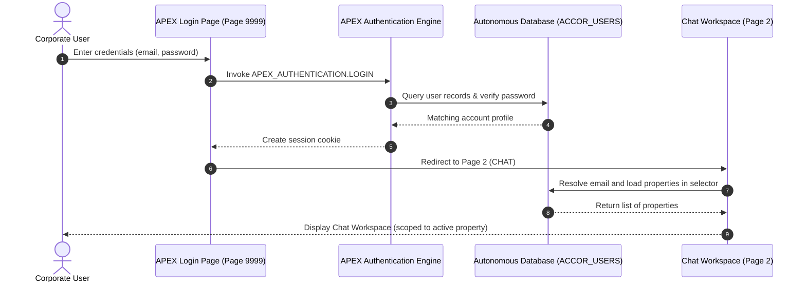
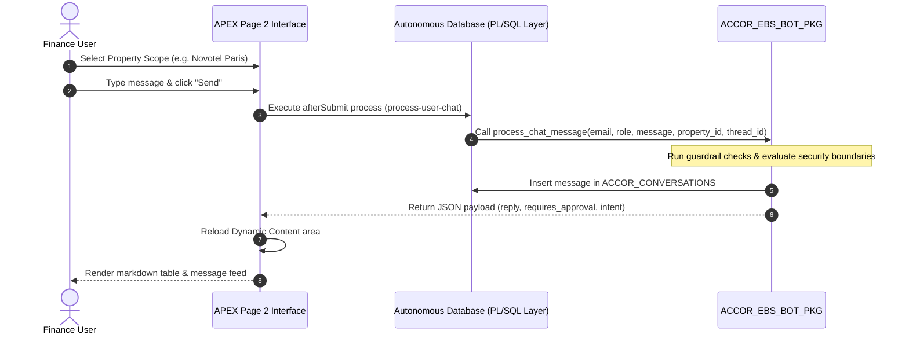
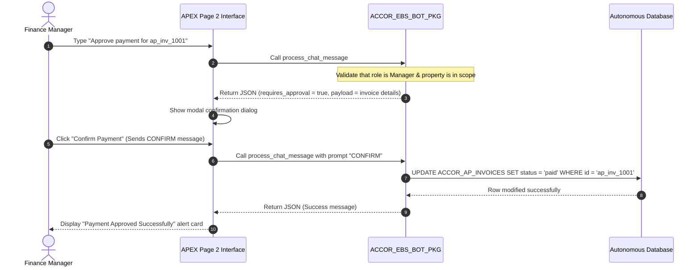
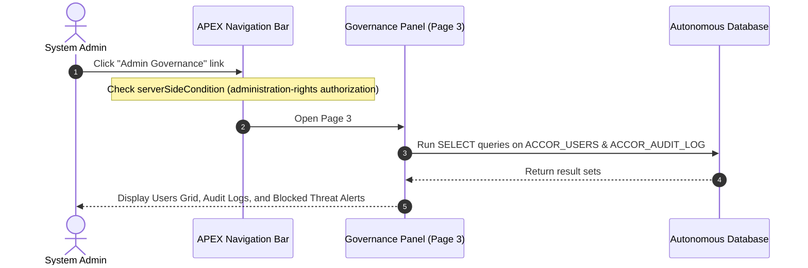

# App Flow & User Journeys — ACCOR EBS Conversational Bot

This document outlines the user interaction paths and sequence diagrams for the APEX application.

---

## 1. Authentication & Role Context Loading

---

## 2. Interactive Conversational Chat Loop

---

## 3. Gated Transaction Write Workflow (Managers Only)

For write-based actions (such as paying or approving invoices), the bot enforces a confirmation gate before altering table states:

---

## 4. Admin Threat & Governance Auditing

