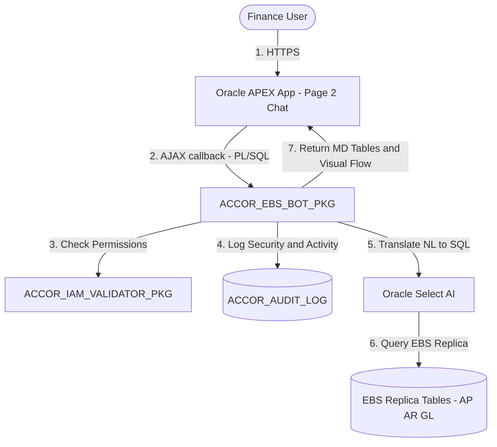

# 🧠 ACCOR EBS Finance Conversational Bot POC

A secure, context-aware conversational chatbot built for the **ACCOR Corporate Finance team**. It interfaces natively with replica tables representing Oracle EBS Finance modules (AP, AR, GL) hosted on an **OCI Autonomous Transaction Processing (ATP) 23ai database** and runs inside **Oracle APEX**.

---

## 🏗️ Architecture Overview

The system runs entirely within the native Oracle ecosystem, bypassing external middle-tier hosting. The database serves as both the data layer and the agent orchestration engine.



### Key Technical Specs:
* **Presentation Tier:** Oracle APEX (defined as compiler-valid APEXlang `.apx` configurations under `applications/accor_ebs_bot/`).
* **Database & Logic Tier:** OCI Autonomous Database (ATP 23ai) hosting SQL tables, constraints, and PL/SQL packages.
* **Orchestration & State Management:** Handles user queries, locks analyst roles from executing DML, parses intents, and processes multi-turn states inside `ACCOR_EBS_BOT_PKG`.
* **Guardrails:** Protects against SQL/Prompt injection and property scope violations via `ACCOR_IAM_VALIDATOR_PKG`.
* **Natural Language to SQL:** Uses native `DBMS_CLOUD_AI` (Select AI) stateless profile configurations to interface with OCI Generative AI or external LLMs (e.g. OpenAI).

---

## 📦 Project Structure

```text
ojas-apex-varient/
├── applications/
│   └── accor_ebs_bot/            # Oracle APEX App (APEXlang Spec)
│       ├── page-groups.apx
│       ├── pages/                # Page 2 (Chat) & Page 3 (Admin Panel)
│       └── shared-components/    # Authentication & Authorization Rules
├── backend/
│   └── database/                 # Database Schema & Logic Tier
│       ├── schema_install.sql    # EBS tables & seed data
│       ├── accor_ebs_security_pkg.sql # OCI IAM validator
│       ├── accor_ebs_bot_pkg.sql # Bot orchestrator (Select AI integration)
│       └── test_accor_ebs_bot.sql # Automated PL/SQL tests
```

---

## 🚀 Deployment & Local Testing

### 1. Local Validation (APEXlang)
Validate and lint the APEXlang configuration files locally:
```bash
node-env/bin/node .agents/skills/apex/apexlang/tools/apexctl.mjs apexlang validate --app-path applications/accor_ebs_bot
```

### 2. OCI Database & Package Setup
Connect to your OCI Autonomous Database 23ai schema using SQLcl or APEX SQL Commands, and run:
1. `backend/database/schema_install.sql`
2. `backend/database/accor_ebs_security_pkg.sql`
3. `backend/database/accor_ebs_bot_pkg.sql`
4. `backend/database/test_accor_ebs_bot.sql` (to run automated test suites)

### 3. APEX Application Import
1. Navigate to **App Builder** inside your APEX Workspace.
2. Select **Import** and upload the APEXlang application package.
3. Assign the parsing schema to your database schema (e.g. `ACCOR_SCHEMA`) and complete the import.
