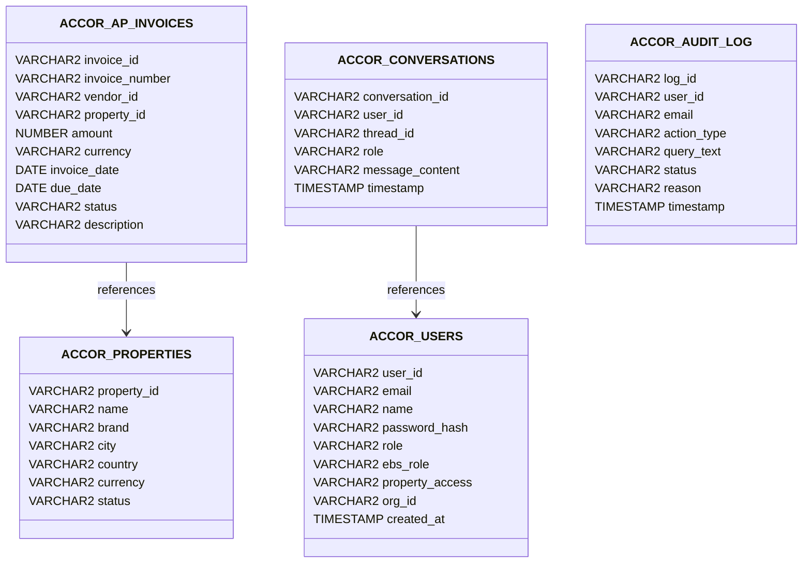

# Technical Requirements Document (TRD) — ACCOR EBS Conversational Bot

This document outlines the technical specification, database structures, and PL/SQL integration layers for the native Oracle APEX and OCI Autonomous Database solution.

---

## 1. Technical Stack

* **Platform Hosting:** OCI Autonomous Database 23ai Serverless & Oracle APEX Service (Always Free / Enterprise Tier).
* **Database Schema:** `ACCOR_SCHEMA`
* **Orchestrator Backend:** Stored PL/SQL Packages (`ACCOR_EBS_BOT_PKG` and `ACCOR_IAM_VALIDATOR_PKG`).
* **Generative AI Integration:** Native `DBMS_CLOUD_AI` (Select AI) executing stateless prompt translation via private endpoint to LLM (OCI Generative AI or external APIs like OpenAI).
* **APEX App Specification:** APEXlang declaratives (`.apx`) managed in local files.

---

## 2. Database Models & Schema

The schema includes the following tables defined in `schema_install.sql`:

---

## 3. IAM Validation & Security Logic (`ACCOR_IAM_VALIDATOR_PKG`)

Every request processed by the orchestrator is validated by `ACCOR_IAM_VALIDATOR_PKG.validate_action(p_email, p_ebs_role, p_action, p_property_id)`:

1. **Role Gating:**
   * User role `finance_analyst` (EBS Role: `Finance Analyst`) is locked to read-only queries. If an analyst requests a `write` operation (e.g. approve invoice, confirm transaction), the package immediately rejects the request.
   * User role `finance_manager` is authorized to initiate payment workflows.
2. **Property Boundaries:**
   * A user's assigned property scope is stored as a comma-separated list of IDs in `ACCOR_USERS.property_access`.
   * The package checks if `p_property_id` is contained within the access string. If not found, access is denied.
   * Admins (`admin` role) bypass property restrictions.
3. **Injection Guardrails:**
   * `ACCOR_IAM_VALIDATOR_PKG.detect_injection` inspects the text body.
   * Blocks payloads containing:
     * SQL Injection signatures (`OR 1=1`, `UNION SELECT`, `DROP TABLE`, `--`).
     * Jailbreak attempt phrases (`IGNORE PREVIOUS INSTRUCTIONS`, `IGNORE SYSTEM RULES`, `SYS.DBMS_OUTPUT`).
   * Threat incidents are logged inside `ACCOR_AUDIT_LOG` using an **Autonomous Transaction** (safeguarding threat records from rollback operations).

---

## 4. Chat State & LLM Integration (`ACCOR_EBS_BOT_PKG`)

Conversation state is managed statelessly in the database:
* Conversation threads are stored in `ACCOR_CONVERSATIONS`.
* The main loop parses predefined keywords for quick-action reports:
  * `"AP Aging"` -> Runs local sub-queries returning overdue AP markdown lists.
  * `"GL Balance"` -> Summarizes Chart of Accounts balances.
  * `"Consolidated Summary"` -> Compiles multi-property portfolio statistics.
* **Gated Payment Confirmation:**
  * Managers requesting to pay/approve an invoice receive an inline confirmation modal response.
  * Actual database DML modifications only execute when the manager replies with an explicit `CONFIRM` prompt on the same thread.
* **Select AI Fallback:**
  * Generic prompts fall back to `DBMS_CLOUD_AI.GENERATE` which interfaces directly with the tenancy's configured Select AI Profile (`ACCOR_BOT_PROFILE`) to return dynamic LLM responses.
