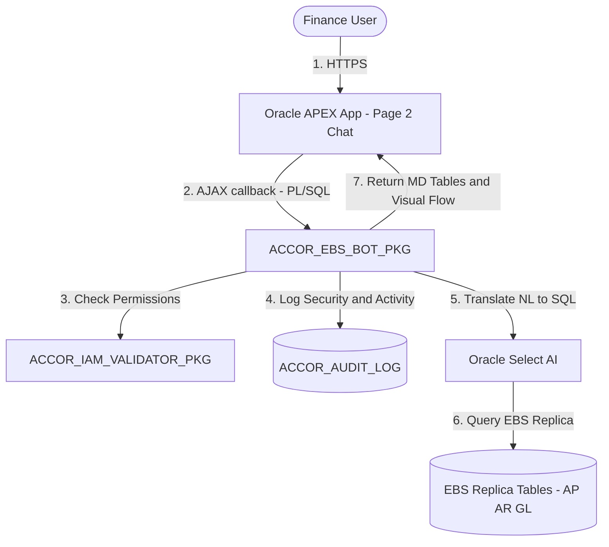
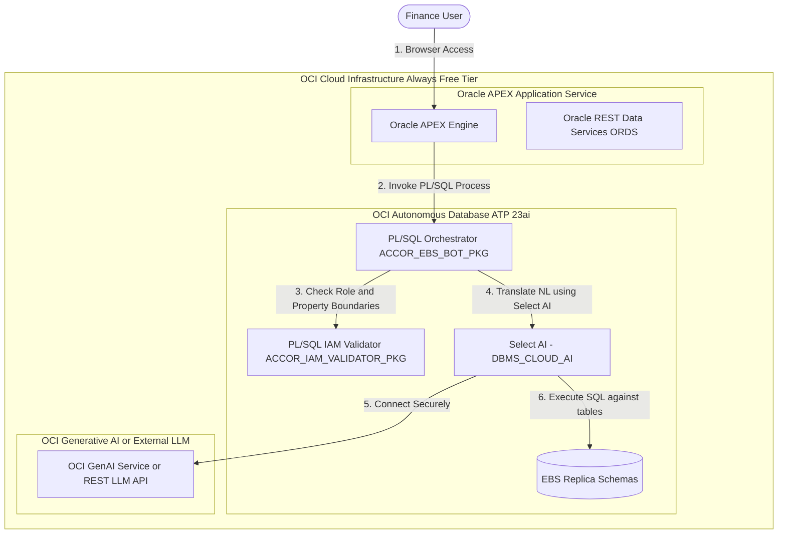
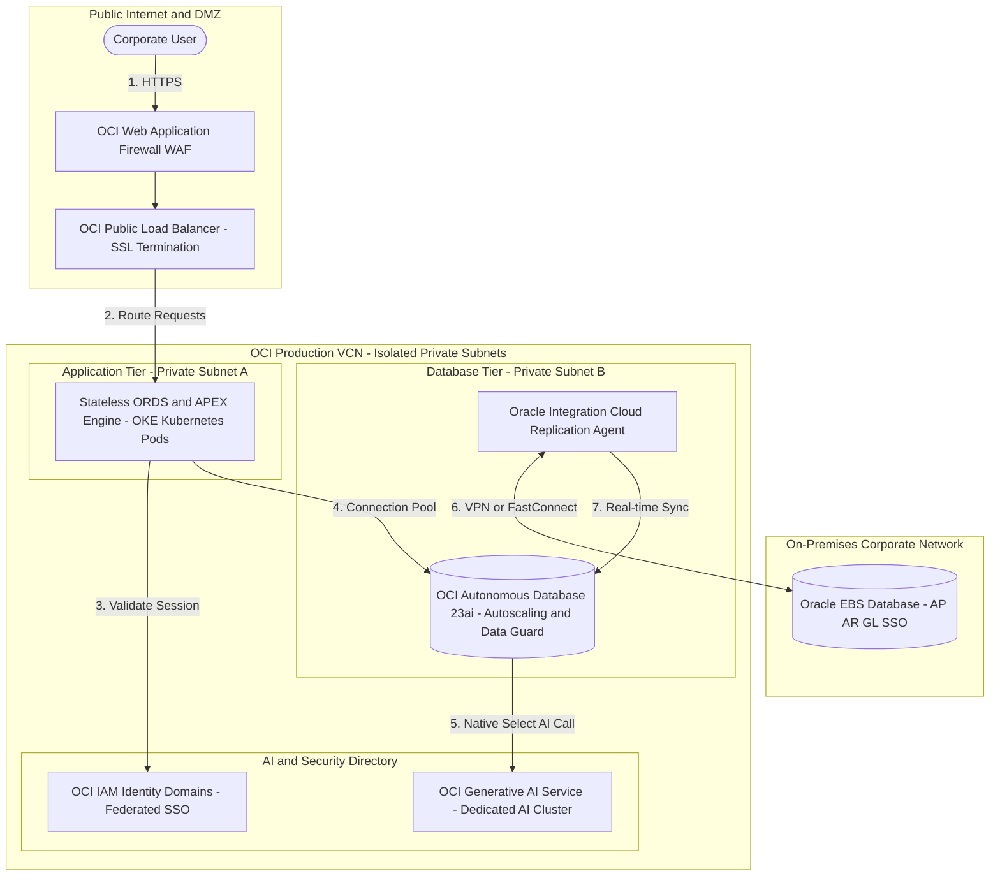

# Native Oracle APEX & OCI Finance Conversational Bot — Implementation Plan

This implementation plan details the architecture, design, database schemas, PL/SQL packages, and APEXlang specifications required to build the **ACCOR EBS Finance Conversational Bot** natively inside the Oracle ecosystem (Oracle APEX and OCI Autonomous Database). 

---

## 📌 Proposed Solution Architecture

Instead of hosting a standalone React/FastAPI mockup, the solution will run entirely within the Oracle Cloud (OCI) database and application layers:



---

## 🌐 OCI Always Free Tier Deployment Architecture

For the POC environment, we will map the architecture to OCI Always Free Tier components:



---

## 🏢 Enterprise Production Deployment Architecture

To support **1000+ concurrent corporate users** with enterprise-grade reliability, high availability, and security in production, the architecture scales out of the Free Tier into a fully resilient, isolated virtual cloud network (VCN) topology on Oracle Cloud Infrastructure (OCI):



### Production Architectural Components & Scaling Policies:

1. **Network Security & Isolation:**
   * **VCN Topology:** All database, application, and AI services run inside dedicated private subnets. The database has no public IP address and is accessible only through a private endpoint.
   * **DMZ Layer:** All incoming user traffic goes through the **OCI Web Application Firewall (WAF)** (protecting against DDoS, cross-site scripting, and request flooding) and then is distributed by the **OCI Load Balancer**.
   * **FastConnect / IPSec VPN:** The connection from OCI back to the **On-Premise Oracle EBS database** is established using OCI FastConnect or a secure IPSec VPN tunnel, isolating EBS sync traffic from the public internet.

2. **Application Tier (Autoscaling Web Servers):**
   * Instead of a shared APEX developer instance, the production APEX runtime and **Oracle REST Data Services (ORDS)** run inside a Dockerized Tomcat/WebLogic cluster managed by **Oracle Cloud Infrastructure Container Engine for Kubernetes (OKE)**.
   * **Horizontal Pod Autoscaling (HPA):** Scales the ORDS containers dynamically based on CPU/memory utilization to easily support 1000+ concurrent requests.

3. **Database Tier (Resilience & Zero-Downtime):**
   * **OCI Autonomous Transaction Processing (ATP 23ai):**
     * **Autoscaling Enabled:** Automatically scales OCPUs up to 3x active capacity during peak financial reporting periods without manual intervention.
     * **Autonomous Data Guard:** Configured with a cross-Availability Domain or cross-Region standby instance. If the primary instance goes down, failover occurs automatically in less than 2 minutes (RTO < 2 min, RPO = 0).
     * **Connection Pooling:** Managed automatically by ORDS to optimize query concurrency and prevent database thread exhaustion.

4. **Private Generative AI Integration:**
   * To prevent data leaks and comply with strict corporate audit regulations, the database does not call public APIs (like OpenAI or public Gemini). Instead, it queries the **OCI Generative AI Service** via a private endpoint, hosting open-weight models (e.g. Llama-3, Cohere Command R+) on OCI's dedicated AI clusters.

5. **EBS Data Synchronization:**
   * **Oracle Integration Cloud (OIC)** or **Oracle Data Integrator (ODI)** agents periodically pull incremental AP, AR, and GL updates from the on-premises EBS database and push them into the OCI ATP replica tables, ensuring the chat bot queries near-real-time records.

---

## 🛠️ Step-by-Step OCI Free Tier Provisioning Guide

Follow these instructions to provision the OCI database, initialize the APEX Workspace, and configure database AI credentials:

### 1. Provisioning OCI Autonomous Database (ATP 23ai)
1. Log in to your **OCI Console** (Trial or Always Free Account).
2. Open the main navigation menu and go to **Oracle Database** -> **Autonomous Database**.
3. Click **Create Autonomous Database**.
4. Configure the details:
   - **Compartment:** Select your preferred compartment (or root).
   - **Display Name & Database Name:** Set both to `ACCOR_EBS_DB`.
   - **Workload Type:** Select **Transaction Processing** (ATP).
   - **Deployment Type:** Select **Shared Infrastructure**.
   - **Database Version:** Choose **23ai** (required for native `DBMS_CLOUD_AI` Select AI translation).
   - **OCPU Count:** `1` (Always Free Eligible).
   - **Storage (TB):** `0.02` (20 GB - Always Free Eligible).
   - **Auto Scaling:** Uncheck (to keep resource limits within Always Free boundaries).
   - **Administrator Credentials:** Enter a secure password for the `ADMIN` account.
   - **Network Access:** Select **Secure access from everywhere** (or restrict to your local developer IP address).
   - **License Type:** Select **License Included**.
5. Click **Create Autonomous Database**. Wait ~5 minutes for status to become **Available**.

### 2. Initializing Oracle APEX Service Workspace
1. On the Autonomous Database Details page, click **Database Actions** and select **APEX** from the menu.
2. Log in to the **APEX Administration Services** console:
   - **Workspace:** `INTERNAL`
   - **Username:** `ADMIN`
   - **Password:** The password set during database creation.
3. Click **Create Workspace** to define the development space:
   - **Workspace Name:** `ACCOR_DEV`
   - **Database User:** Create a new user named `ACCOR_SCHEMA`
   - **Password:** Define a strong schema password.
4. Log out of `INTERNAL` and sign in to the new workspace `ACCOR_DEV` as user `ADMIN` or `ACCOR_SCHEMA` to import your APEX application files.

### 3. Database Schema Setup and PL/SQL Package Deployment
Connect using SQLcl or execute scripts via **APEX SQL Workshop -> SQL Commands**:
1. Run `schema_install.sql` to install all EBS tables (`ACCOR_USERS`, `ACCOR_AP_INVOICES`, etc.) and seed data.
2. Run `accor_ebs_security_pkg.sql` to compile the `ACCOR_IAM_VALIDATOR_PKG` database package.
3. Run `accor_ebs_bot_pkg.sql` to compile the `ACCOR_EBS_BOT_PKG` database package.

### 4. Configuring OCI GenAI/Select AI Credentials
In the database, run the following PL/SQL block to register the LLM credentials and map the Select AI Profile:
```sql
BEGIN
  -- 1. Create API key credential
  DBMS_CLOUD.CREATE_CREDENTIAL(
    credential_name => 'ACCOR_LLM_CREDENTIAL',
    username        => 'API_KEY',
    password        => 'your_actual_llm_api_key_or_oci_token'
  );
  
  -- 2. Define the Select AI profile for NLP translation
  DBMS_CLOUD_AI.CREATE_PROFILE(
    profile_name => 'ACCOR_BOT_PROFILE',
    attributes   => '{"provider": "openai", "model": "gpt-4o", "credential_name": "ACCOR_LLM_CREDENTIAL"}'
  );
END;
/
```
*(Swap `"openai"` and model name if connecting to OCI Generative AI Service or Google Gemini).*

---

## User Review Required

> [!IMPORTANT]
> **Native Oracle Architecture:** We are pivoting from the FastAPI/React mockup to a production-ready Oracle APEX application package. The application is represented as APEXlang text specifications (`.apx`) under `applications/accor_ebs_bot/` which can be validated and compiled into SQLcl import scripts.
>
> **Select AI Integration:** We will use Oracle's native `DBMS_CLOUD_AI` (Select AI) package to interpret and run natural language queries, allowing the AI to execute SQL directly within the database boundaries securely.
>
> **Access Control Constraints:** All security guardrails (prompt injection filtering, property access containment, and role boundaries) will be enforced at the database level inside PL/SQL packages.

---

## Open Questions

> [!WARNING]
> 1. **Oracle Database Version:** Does your OCI Trial account run Oracle Database 23ai? (23ai is required for native **Select AI / DBMS_CLOUD_AI** support. If running 19c, we will fallback to using `APEX_WEB_SERVICE` to call LLM endpoints from PL/SQL).
> 2. **AI Provider Credentials:** Which LLM provider should the database connect to (e.g. OCI Generative AI, OpenAI, or Google Gemini)? We will need to set up a database credential using `DBMS_CLOUD.create_credential`.

---

## Proposed Changes

### 1. Database Schemas & PL/SQL Backend

#### [NEW] [schema_install.sql](file:///Users/anilmn/Desktop/Projects/ojas-apex-varient/backend/database/schema_install.sql)
* DDL to create tables:
  * `ACCOR_USERS`: Email, password hash, role (`analyst`, `manager`, `admin`), ebs_role, assigned properties, and organization context.
  * `ACCOR_PROPERTIES`: Property IDs, names, cities, currencies.
  * `ACCOR_AP_INVOICES` & `ACCOR_AR_INVOICES`: Accounts Payable and Accounts Receivable records.
  * `ACCOR_GL_ACCOUNTS`: General Ledger Chart of Accounts.
  * `ACCOR_JOURNAL_ENTRIES` & `ACCOR_JOURNAL_LINES`: Journal transactions.
  * `ACCOR_AUDIT_LOG`: Logs of chats, actions, and blocked security threats.
* DML scripts to seed initial ACCOR properties, vendors, GL accounts, and users.

#### [NEW] [accor_ebs_security_pkg.sql](file:///Users/anilmn/Desktop/Projects/ojas-apex-varient/backend/database/accor_ebs_security_pkg.sql)
* PL/SQL package specification and body `ACCOR_IAM_VALIDATOR_PKG`.
* Exposes `validate_action(p_email, p_ebs_role, p_action, p_property_id)`:
  * Restricts analysts to `read` actions only.
  * Ensures managers can only read/write within their property access list.
  * Blocks SQL injection keywords (`OR 1=1`, `UNION`, `--`) or prompt injection attempts in input parameters.

#### [NEW] [accor_ebs_bot_pkg.sql](file:///Users/anilmn/Desktop/Projects/ojas-apex-varient/backend/database/accor_ebs_bot_pkg.sql)
* PL/SQL package `ACCOR_EBS_BOT_PKG` containing the core conversational state logic.
* **`process_chat_message` function:**
  * Validates the request context via `ACCOR_IAM_VALIDATOR_PKG`.
  * Classifies intent (GL balances, AP aging, payment approvals).
  * Executes queries (using Select AI or local keyword extraction).
  * Enforces the payment approval workflow (generates a tokenized confirmation payload that must be confirmed by the client before DML updates occur).
  * Returns formatted markdown tables to the APEX UI.

---

### 2. Oracle APEX Application Configuration (APEXlang)

#### [MODIFY] [application.apx](file:///Users/anilmn/Desktop/Projects/ojas-apex-varient/applications/accor_ebs_bot/application.apx)
* Configure app metadata, application title, global variables (e.g. `G_PROPERTY_CONTEXT`, `G_USER_ROLE`), and bind custom login authentication context.

#### [NEW] [p00002-chat.apx](file:///Users/anilmn/Desktop/Projects/ojas-apex-varient/applications/accor_ebs_bot/pages/p00002-chat.apx)
* **Page 2: Chat Workspace Console:**
  * **Header:** Active property dropdown (`P2_PROPERTY_SELECTOR`) and user profile information.
  * **Chat Region:** A PL/SQL Dynamic Content region rendering the conversation feed.
  * **Input Bar:** Text item `P2_USER_MESSAGE` and suggested chip buttons (AP Aging, GL Balance, etc.) linked to Dynamic Actions.
  * **Approval Drawer/Modal:** An APEX inline drawer or modal dialog gating invoice actions. Includes transaction details and CTA confirmation buttons.
  * **AJAX Process:** Call `ACCOR_EBS_BOT_PKG.process_chat_message` asynchronously to update page state and load bot replies.

#### [NEW] [p00003-admin.apx](file:///Users/anilmn/Desktop/Projects/ojas-apex-varient/applications/accor_ebs_bot/pages/p00003-admin.apx)
* **Page 3: Admin Governance Panel:**
  * Security-gated to Administrator role only.
  * Uses a tabbed layout containing:
    * **Tab 1: Users** (Interactive Grid on `ACCOR_USERS`).
    * **Tab 2: Audit Logs** (Interactive Report on `ACCOR_AUDIT_LOG`).
    * **Tab 3: Blocked security alerts** (Interactive Report on `ACCOR_AUDIT_LOG` showing blocked threats).

#### [MODIFY] [lists.apx](file:///Users/anilmn/Desktop/Projects/ojas-apex-varient/applications/accor_ebs_bot/shared-components/lists.apx)
* Add sidebar navigation entries linking Page 2 (Chat Workspace) and Page 3 (Admin Governance).

---

## Verification Plan

### Automated Verification
* Compile and validate APEXlang files locally to ensure 100% linter and syntax compliance:
  ```bash
  node tools/apexctl.mjs apexlang validate --app-path applications/accor_ebs_bot
  ```
* Run local compiler audit checks:
  ```bash
  node tools/apexctl.mjs apexlang compiler-truth audit --app-path applications/accor_ebs_bot
  ```
* Execute PL/SQL unit tests:
  * Run the test script `backend/database/test_accor_ebs_bot.sql` verifying `ACCOR_IAM_VALIDATOR_PKG` blocks unauthorized transactions and SQL injections, and `ACCOR_EBS_BOT_PKG` correctly transitions payment approval states.

### Manual Verification
* Deploy the SQL schemas, PL/SQL packages, and seed data to your OCI Autonomous Database workspace.
* Import the APEX application into your workspace:
  ```bash
  node tools/apexctl.mjs runtime validate --app-path applications/accor_ebs_bot --db-connection-name <connection>
  ```
* Open the APEX runtime application and walk through the demo scenarios:
  1. Log in as an Analyst (`analyst@accor.com`), confirm read-only access, and try a payment write action (should be blocked by IAM validator).
  2. Log in as a Manager (`manager@accor.com`), request an invoice payment, accept the modal confirmation card, and verify database update.
  3. Send an SQL injection string, confirm it triggers a security warning, and check the admin governance dashboard.
